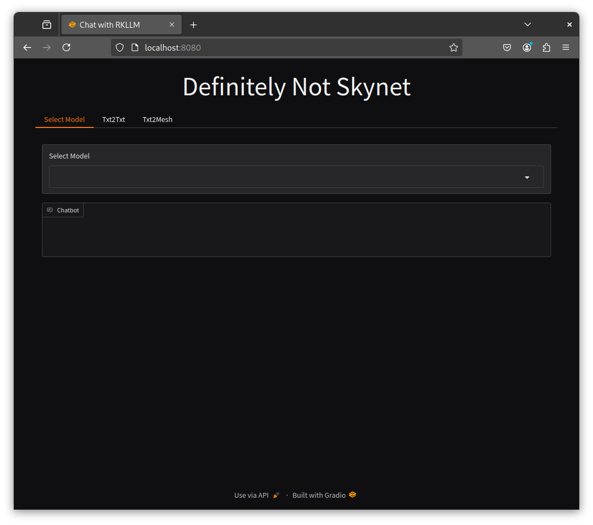
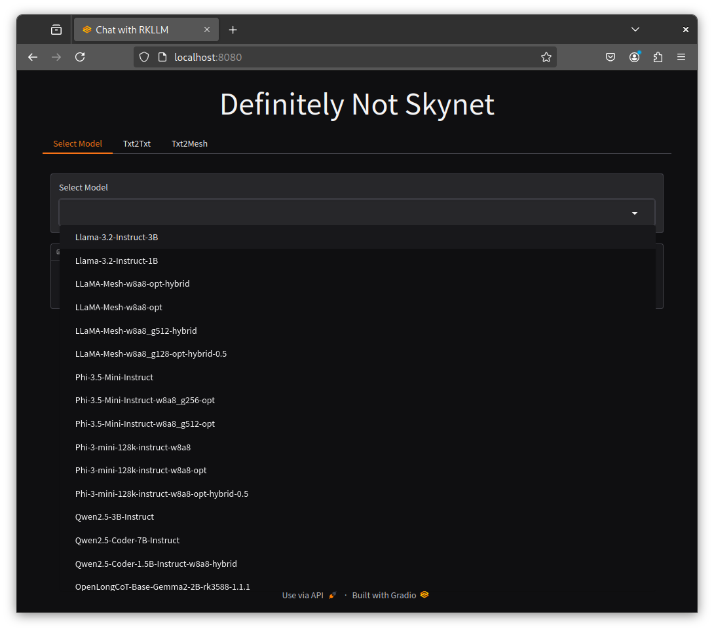
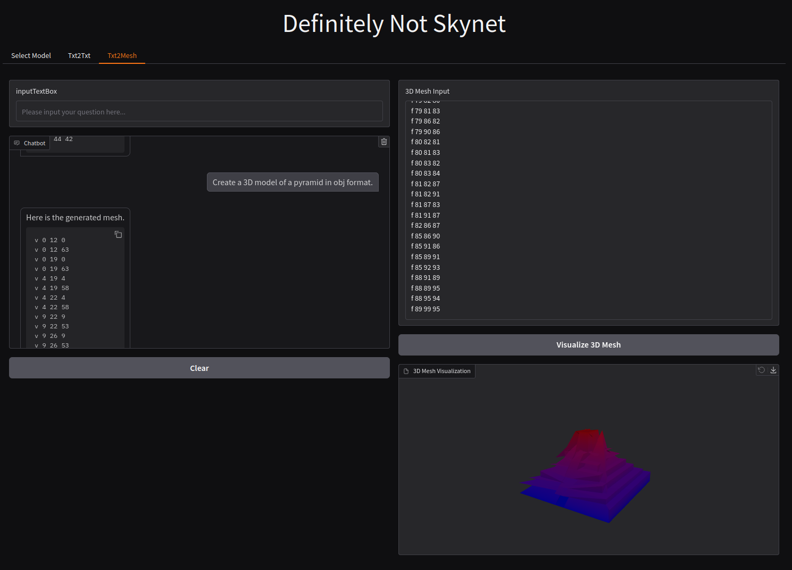

# RKLLM Gradio

### This repository serves as a basic proof-of-concept for a Gradio interface for RKLLM with model switching.

## Getting started

To get started, clone this repository and enter the directory:

```bash
git clone https://github.com/c0zaut/rkllm-gradio && cd rkllm-gradio
```

You can either setup the virtual environment yourself, or run the setup script:

```bash 
bash setup.sh
```

And enter the virtual environment, with all dependencies installed:

```bash
source ~/.venv/rkllm-gradio/bin/activate
(rkllm_gradio) you@hostname: ~/rkllm-gradio $ 
```

If you setup the virtual environment yourself, you can use the provided requirements.txt file for quick dependency resolution.

```bash
(rkllm_gradio) you@hostname: ~/rkllm-gradio $ python -m pip install --upgrade -r requirements.txt
```

Once the application is setup, you will need to download and setup the models.

- Head over to https://huggingface.co/c01zaut and start downloading models!
- Copy the downloaded models to this repo's `./models` directory
- Update the `model_configs` dictionary in `model_configs.py` with the correct filename of the model, and update any parameters as you see fit

With models in place, and `available_models` containing at least 1 local model, you can start the app with:

```bash
(rkllm_gradio) you@hostname: ~/rkllm-gradio $ python rkllm_server_gradio.py
```

Then head over to localhost:8080 in your browser:



Select your model:




And chat:


## Default Version

The default version of the RKLLM library, in `./lib/` is 1.1.2. To change to 1.1.1:

```bash
(rkllm_gradio) you@hostname: ~/rkllm-gradio $ cp -p ./lib/librkllmrt.so.111  ./lib/./lib/librkllmrt.so
```

To change back to 1.1.2:

```bash
(rkllm_gradio) you@hostname: ~/rkllm-gradio $ cp -p ./lib/librkllmrt.so.112  ./lib/./lib/librkllmrt.so
```

## Features

- Chat template is auto generated with Transformers! No more setting "PREFIX" and "POSTFIX" manually!
- Customizable parameters for each model family, including system prompt
- txt2txt LLM inference, accelerated by the RK3588 NPU in a single, easy-to-use interface
- Tabs for selecting model, txt2txt (chat,) and txt2mesh (Llama 3.1 8B finetune.)
- txt2mesh: generate meshes with an LLM! **Needs work - large amount of accuracy loss**





## Limitations

- This is not a production-ready application. It cannot properly handle concurrency, or if users on the same network attempt to do things like load a model at the same time, or attempt to query the model simultaneously. 

- As of this time, only txt2txt models without LoRAs or prompt caches are supported.

- Some of the settings like top_k, top_p, and temperature have to manually adjusted inside of the `model_class.py` script.

## TO DO:

- Add support for multi-modal models

- Incorporate Stable Diffusion: https://huggingface.co/happyme531/Stable-Diffusion-1.5-LCM-ONNX-RKNN2

- Change model dropdown to radio buttons

- Include text box input for system prompt

- Support prompt cache

- Add monitoring for system resources, such as NPU, CPU, GPU, and RAM